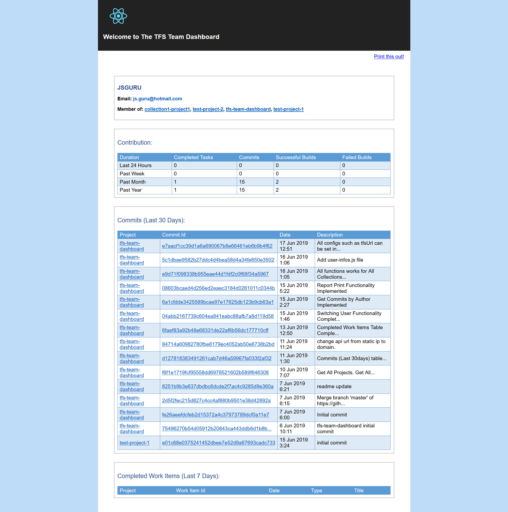

# tfs-team-dashboard
TFS(Team Foundation Server) Monitoring Tool

## Platform

- Microsfot Visual Studio 2013

## ASP.NET version

- ASP.NET 4 MVC

## Front-end

- React

## Configuration file

- tfs-team-dashboard/src/user-infos.js

## Dashboard

